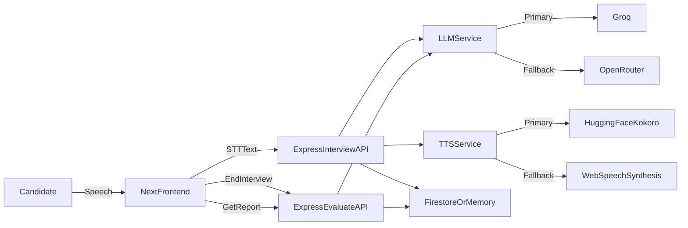

# AI Tutor Interview Screener (Demo)

Voice-based interview simulator for tutor hiring demos.

## Stack

- Frontend: Next.js (App Router) + React + Tailwind CSS
- Backend: Node.js + Express + TypeScript
- STT: Web Speech API (browser microphone)
- TTS: Hugging Face Inference (`hexgrad/Kokoro-82M`) + browser `speechSynthesis` fallback
- LLM: Groq (primary), OpenRouter fallback
- Storage: Firebase Firestore (with in-memory fallback for local demo)

## Project Structure

```txt
AI Tutor/
  frontend/
    src/app/page.tsx
    src/app/interview/page.tsx
    src/app/results/[sessionId]/page.tsx
    src/components/{ChatWindow,MicButton,TranscriptPanel,ScoreCard}.tsx
    src/hooks/{useSpeechRecognition,useSpeechSynthesis}.ts
    src/lib/{api,types,constants}.ts
  backend/
    src/server.ts
    src/routes/{interview,evaluate}.ts
    src/services/{llm,tts,promptBuilder,evaluator,firebase}.ts
    src/types.ts
    .env.example
```

## Architecture



## API Endpoints
 `POST /api/interview`
  - Input: `{ sessionId, candidateText, history[] }`
  - Output: `{ replyText, reprompt?, fallbackUsed?, audioBase64?, usedTtsFallback? }`
- `POST /api/evaluate`
  - Input: `{ sessionId, history[] }`
  - Output: `{ evaluation }`
- `GET /api/evaluate/:sessionId`
  - Output: `{ evaluation }`
- `GET /health`
  - Output: `{ ok: true }`

## Environment Variables

Create `backend/.env` from `backend/.env.example`.

Required for full flow:

- `GROQ_API_KEY`
- `OPENROUTER_API_KEY` (fallback)
- `HUGGINGFACE_API_KEY`
- `HUGGINGFACE_TTS_MODEL` (default `hexgrad/Kokoro-82M`)
- Firebase client config values (`FIREBASE_*`)

Frontend:

- `NEXT_PUBLIC_BACKEND_URL=http://localhost:4000`

## Run Locally

### 1) Start Backend

```bash
cd backend
npm install
npm run dev
```

Backend runs on `http://localhost:4000` by default.

### 2) Start Frontend

```bash
cd frontend
npm install
npm run dev
```

Frontend runs on `http://localhost:3000`.

## Demo Flow

1. Open landing page and click **Start Interview**.
2. App plays first interviewer question.
3. Click mic button and answer by voice.
4. Backend generates adaptive follow-up.
5. Click **End Interview** to generate report.
6. Results page shows scores, reasoning, and evidence quotes for:
   - clarity
   - simplicity
   - patience
   - warmth
   - fluency

## Edge Cases Handled

- No speech detected -> UI prompt to retry.
- Very short answer -> reprompt follow-up from interviewer.
- LLM primary failure -> OpenRouter fallback.
- Hugging Face TTS failure/missing key -> browser speech fallback.
- Malformed evaluation JSON -> single repair pass + schema validation.

## Validation Commands

```bash
# Frontend lint and build
cd frontend
npm run lint
npm run build

# Backend type build
cd ../backend
npm run build
```
